# Polyglot Codebase Knowledge Graph

> Generated offline by **readmenator**. Supports C, C++, Python, Go, Rust, JS/TS, Java, C#, Shell, PHP, Dart, GDScript, Nim, ASM, Ruby, Swift, Kotlin, Scala, Lua, Elixir.
> No LLMs. No tokens. Pure static analysis. See more [here](https://github.com/grisuno/ReadMenator)

**Total Files Parsed:** 3 | **Total Symbols Extracted:** 25 | **Total Imports:** 29
 | **Resolved Imports:** 1

<!-- ranking_model: v1.0 | weights: {ppr:0.45,auth:0.2,test:0.15,doc:0.1,fresh:0.1} | alpha:0.85 | commit:75d209c | date:2026-07-18 -->


## Table of Contents

1. [Statistics Dashboard](#statistics-dashboard)
2. [Architectural Layers](#architectural-layers)
3. [Ranked Context](#ranked-context)
4. [God Nodes](#god-nodes)
5. [Community Analysis](#community-analysis)
6. [Suggested Questions](#suggested-questions)
7. [Hotspot Analysis](#hotspot-analysis)
8. [Change Impact Analysis](#change-impact-analysis)
9. [Suggested Linting Rules](#suggested-linting-rules)
10. [Orphans](#orphans)
11. [Query Recipes](#query-recipes)
12. [Structural Knowledge Map](#structural-knowledge-map)
13. [UML Class Diagram](#uml-class-diagram)
14. [Code Property Graph](#code-property-graph)
15. [Architecture Reference](#architecture-reference)
    - [PY (2 files)](#py-2-files)
    - [SH (1 files)](#sh-1-files)

---

## Statistics Dashboard

| Metric | Value |
|--------|-------|
| Total Files | 3 |
| Total Symbols | 25 |
| Total Imports | 29 |
| Call Edges | 750 |
| Inheritance Edges | 1 |
| Languages | 2 |
| Avg Symbols/File | 8.3 |
| Avg Imports/File | 9.7 |
| Resolved Imports | 1 |

### Top Files by Import Count (Fan-Out)

| File | Imports | Symbols | Language |
|------|---------|---------|----------|
| `view.py` | 20 | 14 | py |
| `app.py` | 9 | 11 | py |

---

## Architectural Layers

Auto-detected from path patterns, naming conventions, and imported frameworks.

| Layer | Files |
|-------|-------|
| utility | 2 |
| presentation | 1 |

### utility

- `app.py` (py, 11 symbols)
- `install.sh` (sh, 0 symbols)

### presentation

- `view.py` (py, 14 symbols)

---

## Ranked Context

Files ranked by composite score for the current query context. The ranking combines Personalized PageRank (query relevance), global authority, test coverage, documentation coverage, and code freshness. Model: v1.0.

| Rank | File | Composite | PPR | Authority | Test | Doc |
|------|------|-----------|-----|-----------|------|-----|
| 1 | `app.py` | 0.5037 | 0.6491 | 0.6491 | 0.00 | 0.82 |
| 2 | `view.py` | 0.3209 | 0.3509 | 0.3509 | 0.00 | 0.93 |
| 3 | `install.sh` | 0.0000 | 0.0000 | 0.0000 | 0.00 | 0.00 |

---

## God Nodes

Most architecturally central files ranked by combined import/export degree and symbol richness.

| File | Score | Connections | PageRank |
|------|-------|-------------|----------|
| `view.py` | 3.4 | | 0.3509 |
| `app.py` | 3.1 | | 0.6491 |
| `install.sh` | 0.0 | | 0.0000 |

---

## Community Analysis

Files grouped by import-based community detection. Cohesion measures how tightly connected each community is internally.

### root (Cohesion: 1.00)

**2 files** in this community:

- `app.py` (py, 11 symbols)
- `view.py` (py, 14 symbols)

---

## Suggested Questions

Auto-generated exploration prompts based on graph structure:

- What does view.py depend on, and what depends on it? (1 connections)
- What does app.py depend on, and what depends on it? (1 connections)
- What does install.sh depend on, and what depends on it? (0 connections)
- What is KeplerOrbitPredictor in app.py and how is it used?
- What is ThermodynamicAnalyzer in view.py and how is it used?

---

## Hotspot Analysis

Files ranked by combined complexity (symbol count) and centrality (connection count). High-scoring files are architecturally critical and may need refactoring attention.

| File | Complexity | Centrality | Combined | Symbols | Connections |
|------|-----------|------------|----------|---------|-------------|
| `app.py` | 0.786 | 0.476 | 0.600 | 11 | 10 |
| `view.py` | 1.000 | 1.000 | 1.000 | 14 | 21 |
| `install.sh` | 0.000 | 0.000 | 0.000 | 0 | 0 |

---

## Change Impact Analysis

Files sorted by how many other files would be affected if they changed. High-impact files should be changed with caution.

| File | Direct Dependents | Transitive Dependents | Total Impact |
|------|------------------|----------------------|--------------|
| `app.py` | 1 | 0 | 1 |
| `install.sh` | 0 | 0 | 0 |
| `view.py` | 0 | 0 | 0 |

---

## Suggested Linting Rules

Automatically suggested linting and security rules based on patterns detected in the codebase. These can be exported as Semgrep rules using the `--export-rules` flag.

| Rule ID | Severity | Description | Language | Matches |
|---------|----------|-------------|----------|---------|
| `RM001` | info | Large number of functions in py: 22 total | py | 22 |
| `RM002` | info | Print statement found (consider logging instead) | python | 53 |

---

## Orphans

Files with no documentation or low connectivity. These are candidates for documentation investment or cleanup.

- `install.sh` (0 symbols, no doc)

---

## Query Recipes

Example queries you can run against this knowledge base using the ranking engine:

```
# Find files most relevant to a concept
readmenator query "Where is the import resolver implemented?"

# Rank files by relevance to a topic
readmenator query "How does documentation generation work?"

# Explain why a file ranks highly
readmenator query "explain readmenator/_documentation.py"

# Trace dependency paths with ranked context
readmenator query "path from CLI to exporter"
```

The ranking model uses the following signals:

- **Personalized PageRank** (45% weight): query-specific relevance via seed propagation
- **Global Authority** (20% weight): structural importance via standard PageRank
- **Test Coverage** (15% weight): fraction of symbols referenced in test files
- **Doc Coverage** (10% weight): presence of docstrings and file-level docs
- **Freshness** (10% weight): recent modification activity

Results include score decomposition and justification paths for each ranked item.

---

## Structural Knowledge Map

```mermaid
graph TD
    classDef mod fill:#1e1e1e,stroke:#ff6666,stroke-width:2px,color:#fff;
    classDef cls fill:#2d2d2d,stroke:#4ec9b0,stroke-width:2px,color:#fff;
    classDef fn fill:#333,stroke:#dcdcaa,stroke-width:1px,color:#dcdcaa;
    classDef ext fill:#111,stroke:#666,stroke-dasharray:5 5,color:#aaa;
    subgraph community_0 ["root"]
    view_py["view.py (py)"]
    class view_py mod;
    view_py_ThermodynamicAnalyzer["ThermodynamicAnalyzer"]
    class view_py_ThermodynamicAnalyzer cls;
    view_py --> view_py_ThermodynamicAnalyzer
    view_py_GrokkingCaptureWrapper["GrokkingCaptureWrapper"]
    class view_py_GrokkingCaptureWrapper cls;
    view_py --> view_py_GrokkingCaptureWrapper
    view_py_visualize_3d_weights["visualize_3d_weights"]
    class view_py_visualize_3d_weights fn;
    view_py --> view_py_visualize_3d_weights
    view_py_visualize_2d_texture["visualize_2d_texture"]
    class view_py_visualize_2d_texture fn;
    view_py --> view_py_visualize_2d_texture
    view_py_visualize_orbit_predictions["visualize_orbit_predictions"]
    class view_py_visualize_orbit_predictions fn;
    view_py --> view_py_visualize_orbit_predictions
    app_py["app.py (py)"]
    class app_py mod;
    install_sh["install.sh (sh)"]
    class install_sh mod;
    end
    view_py -- resolved_imports --> app_py
    ext_numpy["numpy"]
    class ext_numpy ext;
    app_py -.->|imports| ext_numpy
    ext_torch["torch"]
    class ext_torch ext;
    app_py -.->|imports| ext_torch
    ext_torch_nn["torch.nn"]
    class ext_torch_nn ext;
    app_py -.->|imports| ext_torch_nn
    ext_torch_optim["torch.optim"]
    class ext_torch_optim ext;
    app_py -.->|imports| ext_torch_optim
    ext_sklearn_model_selection["sklearn.model_selection"]
    class ext_sklearn_model_selection ext;
    app_py -.->|imports| ext_sklearn_model_selection
    ext_matplotlib_pyplot["matplotlib.pyplot"]
    class ext_matplotlib_pyplot ext;
    app_py -.->|imports| ext_matplotlib_pyplot
    ext_tqdm["tqdm"]
    class ext_tqdm ext;
    app_py -.->|imports| ext_tqdm
    ext_math["math"]
    class ext_math ext;
    app_py -.->|imports| ext_math
    ext_os["os"]
    class ext_os ext;
    app_py -.->|imports| ext_os
    ext_streamlit["streamlit"]
    class ext_streamlit ext;
    view_py -.->|imports| ext_streamlit
    view_py -.->|imports| ext_numpy
    view_py -.->|imports| ext_torch
    view_py -.->|imports| ext_torch_nn
    ext_plotly_graph_objects["plotly.graph_objects"]
    class ext_plotly_graph_objects ext;
    view_py -.->|imports| ext_plotly_graph_objects
    ext_plotly_subplots["plotly.subplots"]
    class ext_plotly_subplots ext;
    view_py -.->|imports| ext_plotly_subplots
    ext_plotly_express["plotly.express"]
    class ext_plotly_express ext;
    view_py -.->|imports| ext_plotly_express
    ext_sklearn_decomposition["sklearn.decomposition"]
    class ext_sklearn_decomposition ext;
    view_py -.->|imports| ext_sklearn_decomposition
    view_py -.->|imports| ext_sklearn_model_selection
    ext_sys["sys"]
    class ext_sys ext;
    view_py -.->|imports| ext_sys
    view_py -.->|imports| ext_os
    ext_json["json"]
    class ext_json ext;
    view_py -.->|imports| ext_json
    ext_datetime["datetime"]
    class ext_datetime ext;
    view_py -.->|imports| ext_datetime
    ext_scipy["scipy"]
    class ext_scipy ext;
    view_py -.->|imports| ext_scipy
    ext_scipy_spatial_distance["scipy.spatial.distance"]
    class ext_scipy_spatial_distance ext;
    view_py -.->|imports| ext_scipy_spatial_distance
    ext_time["time"]
    class ext_time ext;
    view_py -.->|imports| ext_time
    ext_app["app"]
    class ext_app ext;
    view_py -.->|imports| ext_app
    view_py -.->|imports| ext_scipy_spatial_distance
    ext_sklearn_cluster["sklearn.cluster"]
    class ext_sklearn_cluster ext;
    view_py -.->|imports| ext_sklearn_cluster
    ext_pandas["pandas"]
    class ext_pandas ext;
    view_py -.->|imports| ext_pandas
```



---

## UML Class Diagram

Auto-generated Mermaid class diagram from parsed class-level symbols. Shows classes, structs, interfaces, traits, and their methods with inheritance and dependency relationships.

```mermaid
classDiagram
  class app_py_KeplerOrbitPredictor {
    <<class>>
    +generate_kepler_orbits(n_samples, noise_level, max_time, seed)
    +train_until_grok(model, X_train, y_train, X_test, y_test, max_epochs, patience, initial_lr, min_lr, weight_decay, grok_threshold)
    +analyze_geometric_representation(model, X_sample)
    +expand_model_weights_geometric(base_model, scale_factor)
    +evaluate_model(model, X_test, y_test, model_name, num_examples)
    +plot_learning_curves(history, model_name)
    +main()
    +__init__(self, input_size, hidden_size, output_size)
    +_initialize_weights(self)
    +forward(self, x)
  }
  class view_py_ThermodynamicAnalyzer {
    <<class>>
    +visualize_3d_weights(weights_data, phase_name)
    +visualize_2d_texture(weights_data, phase_name)
    +visualize_orbit_predictions(model, X_test, y_test, num_samples)
    +main()
    +compute_metrics(weights_data, phase, epoch)
    +visualize_thermal_engine(thermo_history)
    +__init__(self, model, X_train, y_train, X_test, y_test)
    +train_with_capture(self, max_epochs, snapshot_every)
    +_detect_phase(self, epoch, train_loss, test_loss)
    +_is_loss_dropping_fast(self)
  }
  class view_py_GrokkingCaptureWrapper {
    <<class>>
    +visualize_3d_weights(weights_data, phase_name)
    +visualize_2d_texture(weights_data, phase_name)
    +visualize_orbit_predictions(model, X_test, y_test, num_samples)
    +main()
    +compute_metrics(weights_data, phase, epoch)
    +visualize_thermal_engine(thermo_history)
    +__init__(self, model, X_train, y_train, X_test, y_test)
    +train_with_capture(self, max_epochs, snapshot_every)
    +_detect_phase(self, epoch, train_loss, test_loss)
    +_is_loss_dropping_fast(self)
  }
```



---

## Code Property Graph

Machine-readable Code Property Graph (CPG) in JSON-LD format. This block allows AI agents to parse the full structural graph without additional file reads. Compatible with GraphRAG pipelines.

```json
{"@context": "https://schema.org", "analysis": {"communities": [{"cohesion": 1.0, "id": 0, "label": "root", "size": 2}], "god_nodes": [{"node_id": "view.py", "score": 3.4}, {"node_id": "app.py", "score": 3.1}, {"node_id": "install.sh", "score": 0.0}], "surprising_connections": []}, "edges": [{"confidence": "EXTRACTED", "relation": "imports", "source": "app.py", "target": "numpy"}, {"confidence": "EXTRACTED", "relation": "imports", "source": "app.py", "target": "torch"}, {"confidence": "EXTRACTED", "relation": "imports", "source": "app.py", "target": "torch.nn"}, {"confidence": "EXTRACTED", "relation": "imports", "source": "app.py", "target": "torch.optim"}, {"confidence": "EXTRACTED", "relation": "imports", "source": "app.py", "target": "sklearn.model_selection"}, {"confidence": "EXTRACTED", "relation": "imports", "source": "app.py", "target": "matplotlib.pyplot"}, {"confidence": "EXTRACTED", "relation": "imports", "source": "app.py", "target": "tqdm"}, {"confidence": "EXTRACTED", "relation": "imports", "source": "app.py", "target": "math"}, {"confidence": "EXTRACTED", "relation": "imports", "source": "app.py", "target": "os"}, {"confidence": "EXTRACTED", "relation": "imports", "source": "view.py", "target": "streamlit"}, {"confidence": "EXTRACTED", "relation": "imports", "source": "view.py", "target": "numpy"}, {"confidence": "EXTRACTED", "relation": "imports", "source": "view.py", "target": "torch"}, {"confidence": "EXTRACTED", "relation": "imports", "source": "view.py", "target": "torch.nn"}, {"confidence": "EXTRACTED", "relation": "imports", "source": "view.py", "target": "plotly.graph_objects"}, {"confidence": "EXTRACTED", "relation": "imports", "source": "view.py", "target": "plotly.subplots"}, {"confidence": "EXTRACTED", "relation": "imports", "source": "view.py", "target": "plotly.express"}, {"confidence": "EXTRACTED", "relation": "imports", "source": "view.py", "target": "sklearn.decomposition"}, {"confidence": "EXTRACTED", "relation": "imports", "source": "view.py", "target": "sklearn.model_selection"}, {"confidence": "EXTRACTED", "relation": "imports", "source": "view.py", "target": "sys"}, {"confidence": "EXTRACTED", "relation": "imports", "source": "view.py", "target": "os"}, {"confidence": "EXTRACTED", "relation": "imports", "source": "view.py", "target": "json"}, {"confidence": "EXTRACTED", "relation": "imports", "source": "view.py", "target": "datetime"}, {"confidence": "EXTRACTED", "relation": "imports", "source": "view.py", "target": "scipy"}, {"confidence": "EXTRACTED", "relation": "imports", "source": "view.py", "target": "scipy.spatial.distance"}, {"confidence": "EXTRACTED", "relation": "imports", "source": "view.py", "target": "time"}, {"confidence": "EXTRACTED", "relation": "imports", "source": "view.py", "target": "app"}, {"confidence": "EXTRACTED", "relation": "imports", "source": "view.py", "target": "scipy.spatial.distance"}, {"confidence": "EXTRACTED", "relation": "imports", "source": "view.py", "target": "sklearn.cluster"}, {"confidence": "EXTRACTED", "relation": "imports", "source": "view.py", "target": "pandas"}, {"confidence": "EXTRACTED", "relation": "resolved_imports", "source": "view.py", "target": "app.py"}], "generator": "readmenator", "metadata": {"edge_count": 781, "file_count": 3, "language_count": 2, "symbol_count": 25}, "nodes": [{"doc": "_*_ coding: utf8 _*_", "id": "app.py", "kind": "module", "label": "app.py", "language": "py", "sha256": "85d9cb37f7dafa1d", "symbol_count": 11, "symbols": [{"doc": "Generates 2D Keplerian orbit data with enhanced control and quality.\nOptimized version to facilitate physical algorithm grokking.", "kind": "function", "line": 22, "name": "generate_kepler_orbits", "signature": "def generate_kepler_orbits(n_samples, noise_level, max_time, seed)"}, {"doc": "Optimized MLP for learning physical algorithms with geometric structure", "kind": "class", "line": 67, "name": "KeplerOrbitPredictor", "signature": "class KeplerOrbitPredictor(Module)"}, {"doc": "Adaptive training optimized for physical problems.\nCompatible with older PyTorch versions (without 'verbose' argument).", "kind": "method", "line": 93, "name": "train_until_grok", "signature": "def train_until_grok(model, X_train, y_train, X_test, y_test, max_epochs, patience, initial_lr, min_lr, weight_decay, grok_threshold)"}, {"doc": "Analyzes whether the model preserves geometric structures", "kind": "method", "line": 198, "name": "analyze_geometric_representation", "signature": "def analyze_geometric_representation(model, X_sample)"}, {"doc": "GEOMETRIC EXPANSION FOR PHYSICAL PROBLEMS \nPreserves tangent space structure and angular relationships.", "kind": "method", "line": 228, "name": "expand_model_weights_geometric", "signature": "def expand_model_weights_geometric(base_model, scale_factor)"}, {"doc": "Evaluates the model and visualizes predictions vs ground truth", "kind": "method", "line": 282, "name": "evaluate_model", "signature": "def evaluate_model(model, X_test, y_test, model_name, num_examples)"}, {"doc": "Visualizes detailed learning curves", "kind": "method", "line": 366, "name": "plot_learning_curves", "signature": "def plot_learning_curves(history, model_name)"}, {"kind": "method", "line": 391, "name": "main", "signature": "def main()"}, {"kind": "method", "line": 70, "name": "__init__", "signature": "def __init__(self, input_size, hidden_size, output_size)"}, {"doc": "Weight initialization that favors geometric relationship learning", "kind": "method", "line": 82, "name": "_initialize_weights", "signature": "def _initialize_weights(self)"}, {"kind": "method", "line": 89, "name": "forward", "signature": "def forward(self, x)"}]}, {"id": "install.sh", "kind": "module", "label": "install.sh", "language": "sh", "sha256": "c907d80fd6734993", "symbol_count": 0, "symbols": []}, {"doc": "-*- coding: utf-8 -*-", "id": "view.py", "kind": "module", "label": "view.py", "language": "py", "sha256": "b67ce8fcaa63f5cb", "symbol_count": 14, "symbols": [{"doc": "Analyzes weight space as thermodynamic system", "kind": "class", "line": 40, "name": "ThermodynamicAnalyzer", "signature": "class ThermodynamicAnalyzer"}, {"doc": "Wraps app.py training to capture phase transitions", "kind": "class", "line": 182, "name": "GrokkingCaptureWrapper", "signature": "class GrokkingCaptureWrapper"}, {"doc": "3D PCA visualization showing gas/liquid/solid structure", "kind": "method", "line": 535, "name": "visualize_3d_weights", "signature": "def visualize_3d_weights(weights_data, phase_name)"}, {"doc": "2D weight texture visualization", "kind": "method", "line": 638, "name": "visualize_2d_texture", "signature": "def visualize_2d_texture(weights_data, phase_name)"}, {"doc": "Visualize orbital predictions", "kind": "method", "line": 691, "name": "visualize_orbit_predictions", "signature": "def visualize_orbit_predictions(model, X_test, y_test, num_samples)"}, {"kind": "method", "line": 754, "name": "main", "signature": "def main()"}, {"doc": "Calculate complete thermodynamic state", "kind": "method", "line": 44, "name": "compute_metrics", "signature": "def compute_metrics(weights_data, phase, epoch)"}, {"doc": "Complete thermal engine visualization", "kind": "method", "line": 92, "name": "visualize_thermal_engine", "signature": "def visualize_thermal_engine(thermo_history)"}, {"kind": "method", "line": 185, "name": "__init__", "signature": "def __init__(self, model, X_train, y_train, X_test, y_test)"}, {"doc": "Train using EXACT app.py logic with LC and Superposition tracking", "kind": "method", "line": 215, "name": "train_with_capture", "signature": "def train_with_capture(self, max_epochs, snapshot_every)"}, {"doc": "Detect current training phase", "kind": "method", "line": 399, "name": "_detect_phase", "signature": "def _detect_phase(self, epoch, train_loss, test_loss)"}, {"doc": "Check if test loss is dropping rapidly", "kind": "method", "line": 411, "name": "_is_loss_dropping_fast", "signature": "def _is_loss_dropping_fast(self)"}, {"doc": "Capture weight snapshot and thermodynamic state - ALL LAYERS", "kind": "method", "line": 419, "name": "_capture_phase", "signature": "def _capture_phase(self, phase_name, epoch, train_loss, test_loss)"}, {"doc": "Create real-time chart with LC and Superposition", "kind": "method", "line": 447, "name": "_create_realtime_chart_with_metrics", "signature": "def _create_realtime_chart_with_metrics(self)"}]}], "type": "CodePropertyGraph", "version": "1.0"}
```

---

## Architecture Reference

### PY (2 files)

#### `app.py`
**Path:** `app.py`
**File Doc:** *_*_ coding: utf8 _*_*

**Classes:**
- `KeplerOrbitPredictor` (line 67) `class KeplerOrbitPredictor(Module)` - *Optimized MLP for learning physical algorithms with geometric structure*

**Functions:**
- `generate_kepler_orbits` (line 22) `def generate_kepler_orbits(n_samples, noise_level, max_time, seed)` - *Generates 2D Keplerian orbit data with enhanced control and quality.
Optimized version to facilitate physical algorithm grokking.*

**Methods:**
- `train_until_grok` (line 93) `def train_until_grok(model, X_train, y_train, X_test, y_test, max_epochs, patience, initial_lr, min_lr, weight_decay, grok_threshold)` - *Adaptive training optimized for physical problems.
Compatible with older PyTorch versions (without 'verbose' argument).*
- `analyze_geometric_representation` (line 198) `def analyze_geometric_representation(model, X_sample)` - *Analyzes whether the model preserves geometric structures*
- `expand_model_weights_geometric` (line 228) `def expand_model_weights_geometric(base_model, scale_factor)` - *GEOMETRIC EXPANSION FOR PHYSICAL PROBLEMS 
Preserves tangent space structure and angular relationships.*
- `evaluate_model` (line 282) `def evaluate_model(model, X_test, y_test, model_name, num_examples)` - *Evaluates the model and visualizes predictions vs ground truth*
- `plot_learning_curves` (line 366) `def plot_learning_curves(history, model_name)` - *Visualizes detailed learning curves*
- `main` (line 391) `def main()`
- `__init__` (line 70) `def __init__(self, input_size, hidden_size, output_size)`
- `_initialize_weights` (line 82) `def _initialize_weights(self)` - *Weight initialization that favors geometric relationship learning*
- `forward` (line 89) `def forward(self, x)`

#### `view.py`
**Path:** `view.py`
**File Doc:** *-*- coding: utf-8 -*-*

**Classes:**
- `ThermodynamicAnalyzer` (line 40) `class ThermodynamicAnalyzer` - *Analyzes weight space as thermodynamic system*
- `GrokkingCaptureWrapper` (line 182) `class GrokkingCaptureWrapper` - *Wraps app.py training to capture phase transitions*

**Methods:**
- `visualize_3d_weights` (line 535) `def visualize_3d_weights(weights_data, phase_name)` - *3D PCA visualization showing gas/liquid/solid structure*
- `visualize_2d_texture` (line 638) `def visualize_2d_texture(weights_data, phase_name)` - *2D weight texture visualization*
- `visualize_orbit_predictions` (line 691) `def visualize_orbit_predictions(model, X_test, y_test, num_samples)` - *Visualize orbital predictions*
- `main` (line 754) `def main()`
- `compute_metrics` (line 44) `def compute_metrics(weights_data, phase, epoch)` - *Calculate complete thermodynamic state*
- `visualize_thermal_engine` (line 92) `def visualize_thermal_engine(thermo_history)` - *Complete thermal engine visualization*
- `__init__` (line 185) `def __init__(self, model, X_train, y_train, X_test, y_test)`
- `train_with_capture` (line 215) `def train_with_capture(self, max_epochs, snapshot_every)` - *Train using EXACT app.py logic with LC and Superposition tracking*
- `_detect_phase` (line 399) `def _detect_phase(self, epoch, train_loss, test_loss)` - *Detect current training phase*
- `_is_loss_dropping_fast` (line 411) `def _is_loss_dropping_fast(self)` - *Check if test loss is dropping rapidly*
- `_capture_phase` (line 419) `def _capture_phase(self, phase_name, epoch, train_loss, test_loss)` - *Capture weight snapshot and thermodynamic state - ALL LAYERS*
- `_create_realtime_chart_with_metrics` (line 447) `def _create_realtime_chart_with_metrics(self)` - *Create real-time chart with LC and Superposition*

### SH (1 files)

#### `install.sh`
**Path:** `install.sh`

*No symbols extracted*
