# Polyglot Codebase Knowledge Graph

> Generated offline by **readmenator**. Supports C, C++, Python, Go, Rust, JS/TS, Java, C#, Shell, PHP, Dart, GDScript, Nim, ASM.
> No LLMs. No tokens. Pure static analysis. See more [here](https://github.com/grisuno/ReadMenator)

**Total Files Parsed:** 3 | **Total Symbols Extracted:** 25 | **Total Imports:** 29

## Structural Knowledge Map

```mermaid
graph TD
    classDef mod fill:#1e1e1e,stroke:#ff6666,stroke-width:2px,color:#fff;
    classDef cls fill:#2d2d2d,stroke:#4ec9b0,stroke-width:2px,color:#fff;
    classDef fn fill:#333,stroke:#dcdcaa,stroke-width:1px,color:#dcdcaa;
    classDef ext fill:#111,stroke:#666,stroke-dasharray:5 5,color:#aaa;
    view_py["view.py (py)"]
    class view_py mod;
    view_py_ThermodynamicAnalyzer["ThermodynamicAnalyzer"]
    class view_py_ThermodynamicAnalyzer cls;
    view_py --> view_py_ThermodynamicAnalyzer
    view_py_GrokkingCaptureWrapper["GrokkingCaptureWrapper"]
    class view_py_GrokkingCaptureWrapper cls;
    view_py --> view_py_GrokkingCaptureWrapper
    view_py_visualize_3d_weights["visualize_3d_weights"]
    class view_py_visualize_3d_weights fn;
    view_py --> view_py_visualize_3d_weights
    view_py_visualize_2d_texture["visualize_2d_texture"]
    class view_py_visualize_2d_texture fn;
    view_py --> view_py_visualize_2d_texture
    view_py_visualize_orbit_predictions["visualize_orbit_predictions"]
    class view_py_visualize_orbit_predictions fn;
    view_py --> view_py_visualize_orbit_predictions
    app_py["app.py (py)"]
    class app_py mod;
    app_py_generate_kepler_orbits["generate_kepler_orbits"]
    class app_py_generate_kepler_orbits fn;
    app_py --> app_py_generate_kepler_orbits
    app_py_KeplerOrbitPredictor["KeplerOrbitPredictor"]
    class app_py_KeplerOrbitPredictor cls;
    app_py --> app_py_KeplerOrbitPredictor
    app_py_train_until_grok["train_until_grok"]
    class app_py_train_until_grok fn;
    app_py --> app_py_train_until_grok
    app_py_analyze_geometric_representation["analyze_geometric_representation"]
    class app_py_analyze_geometric_representation fn;
    app_py --> app_py_analyze_geometric_representation
    app_py_expand_model_weights_geometric["expand_model_weights_geometric"]
    class app_py_expand_model_weights_geometric fn;
    app_py --> app_py_expand_model_weights_geometric
    install_sh["install.sh (sh)"]
    class install_sh mod;
    ext_numpy["numpy"]
    class ext_numpy ext;
    app_py -.->|imports| ext_numpy
    ext_torch["torch"]
    class ext_torch ext;
    app_py -.->|imports| ext_torch
    ext_torch_nn["torch.nn"]
    class ext_torch_nn ext;
    app_py -.->|imports| ext_torch_nn
    ext_torch_optim["torch.optim"]
    class ext_torch_optim ext;
    app_py -.->|imports| ext_torch_optim
    ext_sklearn_model_selection["sklearn.model_selection"]
    class ext_sklearn_model_selection ext;
    app_py -.->|imports| ext_sklearn_model_selection
    ext_matplotlib_pyplot["matplotlib.pyplot"]
    class ext_matplotlib_pyplot ext;
    app_py -.->|imports| ext_matplotlib_pyplot
    ext_tqdm["tqdm"]
    class ext_tqdm ext;
    app_py -.->|imports| ext_tqdm
    ext_math["math"]
    class ext_math ext;
    app_py -.->|imports| ext_math
    ext_os["os"]
    class ext_os ext;
    app_py -.->|imports| ext_os
    ext_streamlit["streamlit"]
    class ext_streamlit ext;
    view_py -.->|imports| ext_streamlit
    view_py -.->|imports| ext_numpy
    view_py -.->|imports| ext_torch
    view_py -.->|imports| ext_torch_nn
    ext_plotly_graph_objects["plotly.graph_objects"]
    class ext_plotly_graph_objects ext;
    view_py -.->|imports| ext_plotly_graph_objects
    ext_plotly_subplots["plotly.subplots"]
    class ext_plotly_subplots ext;
    view_py -.->|imports| ext_plotly_subplots
    ext_plotly_express["plotly.express"]
    class ext_plotly_express ext;
    view_py -.->|imports| ext_plotly_express
    ext_sklearn_decomposition["sklearn.decomposition"]
    class ext_sklearn_decomposition ext;
    view_py -.->|imports| ext_sklearn_decomposition
    view_py -.->|imports| ext_sklearn_model_selection
    ext_sys["sys"]
    class ext_sys ext;
    view_py -.->|imports| ext_sys
    view_py -.->|imports| ext_os
    ext_json["json"]
    class ext_json ext;
    view_py -.->|imports| ext_json
    ext_datetime["datetime"]
    class ext_datetime ext;
    view_py -.->|imports| ext_datetime
    ext_scipy["scipy"]
    class ext_scipy ext;
    view_py -.->|imports| ext_scipy
    ext_scipy_spatial_distance["scipy.spatial.distance"]
    class ext_scipy_spatial_distance ext;
    view_py -.->|imports| ext_scipy_spatial_distance
    ext_time["time"]
    class ext_time ext;
    view_py -.->|imports| ext_time
    ext_app["app"]
    class ext_app ext;
    view_py -.->|imports| ext_app
    view_py -.->|imports| ext_scipy_spatial_distance
    ext_sklearn_cluster["sklearn.cluster"]
    class ext_sklearn_cluster ext;
    view_py -.->|imports| ext_sklearn_cluster
    ext_pandas["pandas"]
    class ext_pandas ext;
    view_py -.->|imports| ext_pandas
```

---

## Architecture Reference

### PY (2 files)

#### `app.py`
**Path:** `app.py`

**Classes:**
- `KeplerOrbitPredictor` (line 67) `class KeplerOrbitPredictor` - *Optimized MLP for learning physical algorithms with geometric structure*

**Functions:**
- `generate_kepler_orbits` (line 22) `def generate_kepler_orbits(n_samples, noise_level, max_time, seed)` - *Generates 2D Keplerian orbit data with enhanced control and quality.
Optimized version to facilitate physical algorithm grokking.*
- `train_until_grok` (line 93) `def train_until_grok(model, X_train, y_train, X_test, y_test, max_epochs, patience, initial_lr, min_lr, weight_decay, grok_threshold)` - *Adaptive training optimized for physical problems.
Compatible with older PyTorch versions (without 'verbose' argument).*
- `analyze_geometric_representation` (line 198) `def analyze_geometric_representation(model, X_sample)` - *Analyzes whether the model preserves geometric structures*
- `expand_model_weights_geometric` (line 228) `def expand_model_weights_geometric(base_model, scale_factor)` - *GEOMETRIC EXPANSION FOR PHYSICAL PROBLEMS 
Preserves tangent space structure and angular relationships.*
- `evaluate_model` (line 282) `def evaluate_model(model, X_test, y_test, model_name, num_examples)` - *Evaluates the model and visualizes predictions vs ground truth*
- `plot_learning_curves` (line 366) `def plot_learning_curves(history, model_name)` - *Visualizes detailed learning curves*
- `main` (line 391) `def main()`
- `__init__` (line 70) `def __init__(self, input_size, hidden_size, output_size)`
- `_initialize_weights` (line 82) `def _initialize_weights(self)` - *Weight initialization that favors geometric relationship learning*
- `forward` (line 89) `def forward(self, x)`

#### `view.py`
**Path:** `view.py`

**Classes:**
- `ThermodynamicAnalyzer` (line 40) `class ThermodynamicAnalyzer` - *Analyzes weight space as thermodynamic system*
- `GrokkingCaptureWrapper` (line 182) `class GrokkingCaptureWrapper` - *Wraps app.py training to capture phase transitions*

**Functions:**
- `visualize_3d_weights` (line 535) `def visualize_3d_weights(weights_data, phase_name)` - *3D PCA visualization showing gas/liquid/solid structure*
- `visualize_2d_texture` (line 638) `def visualize_2d_texture(weights_data, phase_name)` - *2D weight texture visualization*
- `visualize_orbit_predictions` (line 691) `def visualize_orbit_predictions(model, X_test, y_test, num_samples)` - *Visualize orbital predictions*
- `main` (line 754) `def main()`
- `compute_metrics` (line 44) `def compute_metrics(weights_data, phase, epoch)` - *Calculate complete thermodynamic state*
- `visualize_thermal_engine` (line 92) `def visualize_thermal_engine(thermo_history)` - *Complete thermal engine visualization*
- `__init__` (line 185) `def __init__(self, model, X_train, y_train, X_test, y_test)`
- `train_with_capture` (line 215) `def train_with_capture(self, max_epochs, snapshot_every)` - *Train using EXACT app.py logic with LC and Superposition tracking*
- `_detect_phase` (line 399) `def _detect_phase(self, epoch, train_loss, test_loss)` - *Detect current training phase*
- `_is_loss_dropping_fast` (line 411) `def _is_loss_dropping_fast(self)` - *Check if test loss is dropping rapidly*
- `_capture_phase` (line 419) `def _capture_phase(self, phase_name, epoch, train_loss, test_loss)` - *Capture weight snapshot and thermodynamic state - ALL LAYERS*
- `_create_realtime_chart_with_metrics` (line 447) `def _create_realtime_chart_with_metrics(self)` - *Create real-time chart with LC and Superposition*

### SH (1 files)

#### `install.sh`
**Path:** `install.sh`

*No symbols extracted*
